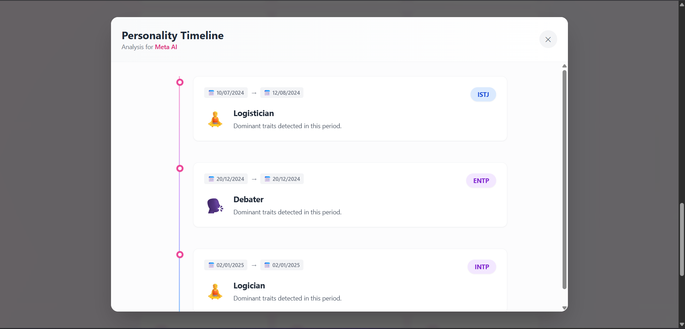
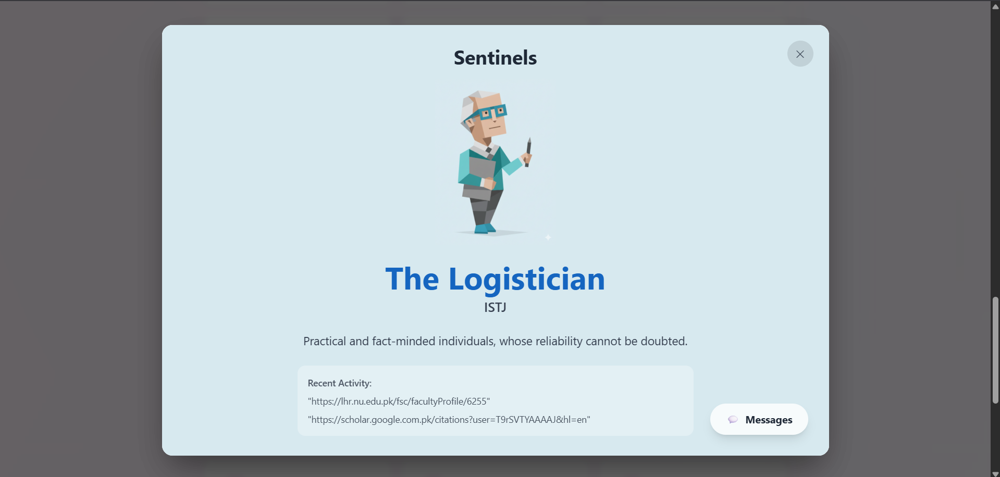
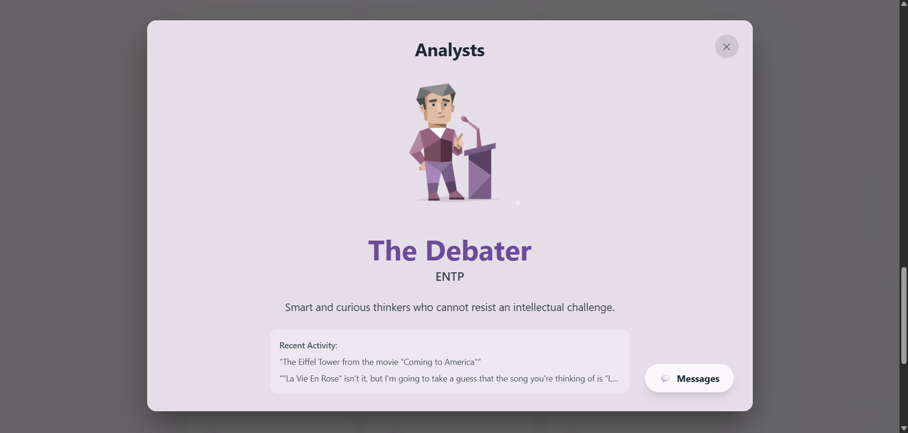
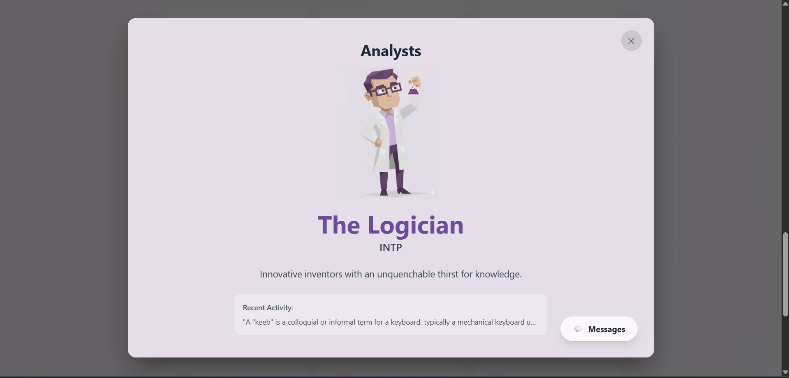
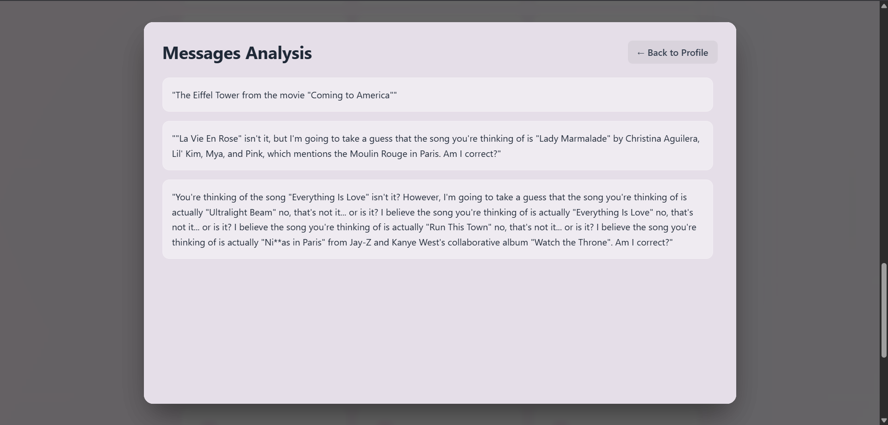
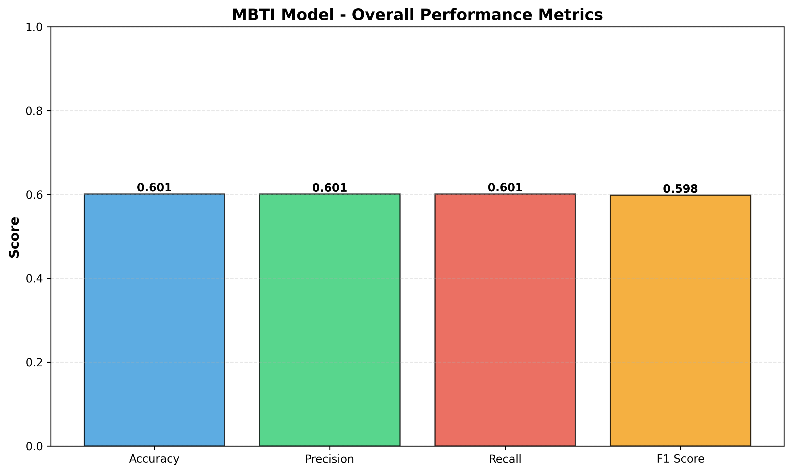
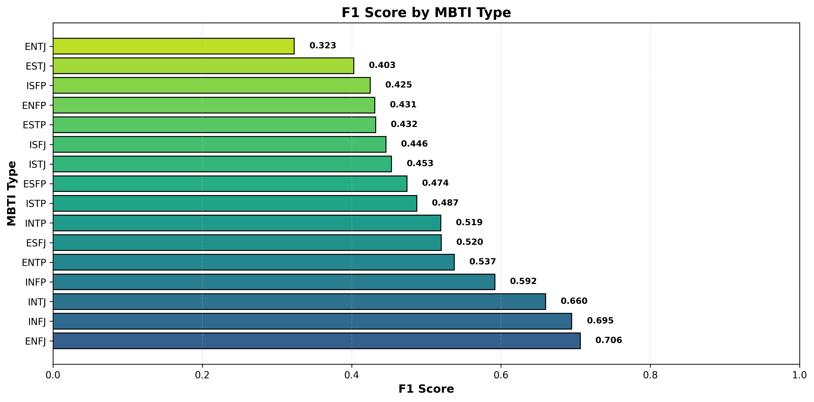
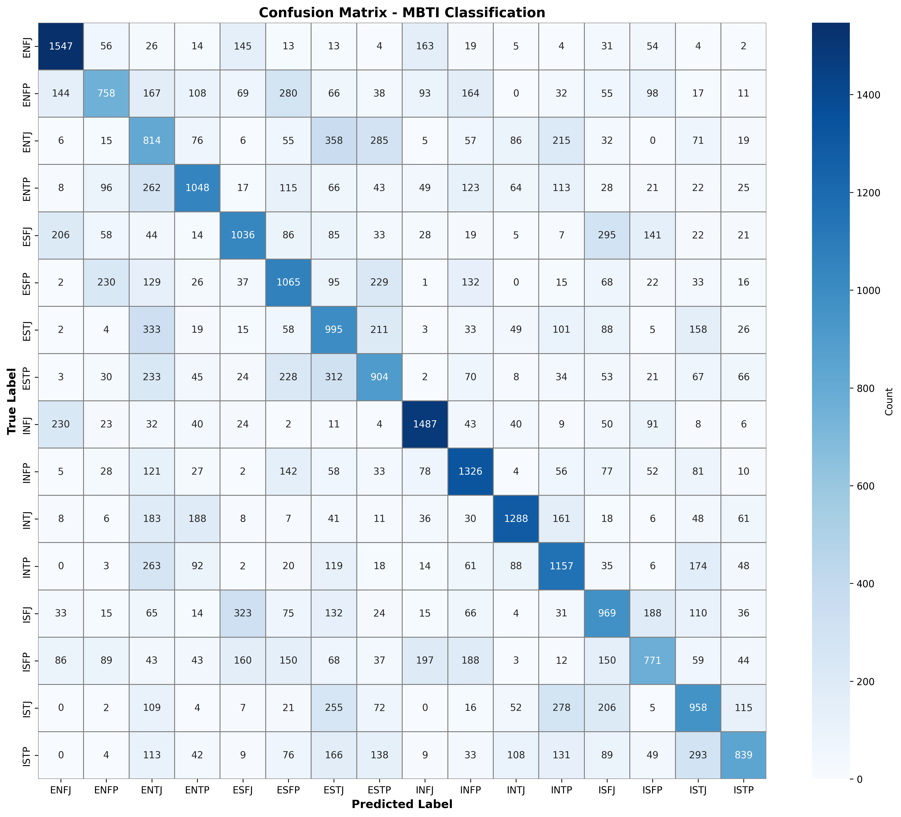
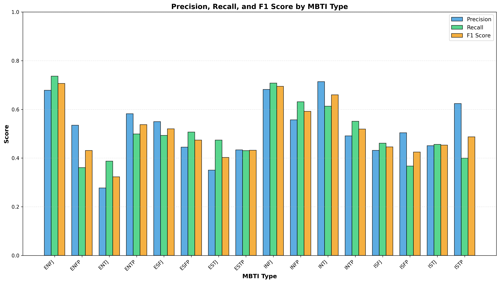

**PersonaFlow** is an MBTI timeline predictor that analyzes personal or group "WhatsApp" chat conversations to predict personality types over time. Users can upload WhatsApp chat exports, select a person from the conversation, and visualize their MBTI personality timeline along with their messages.

## Demo Screenshots








## Tech Stack
### Model Architecture
- **Base Model**: XLM-RoBERTa (Encoder-only Transformer)
- **Framework**: Hugging Face Transformers
- **Loss Function**: Focal Loss (handles class imbalance)
- **Optimizer**: AdamW with gradient clipping
- **Learning Rate**: 2e-5 with linear decay
- **Gradient Accumulation**: Enabled for stable training
- **Batch Size**: 8 (with gradient accumulation)
- **Epochs**: 10
- **Max Sequence Length**: 128 tokens (because usually messages are in short phrases)
- **Evaluation Metrics**: Macro-averaged F1, Precision, Recall, and Accuracy

### Frontend
- **Framework**: React + Vite
- **Styling**: Tailwind CSS

### Backend
- **Framework**: Python Flask
- **ML Integration**: PyTorch with Transformers
- **API**: Gemini API

## Evaluation Metrics
### XLM-RoBERTa Model Performance

Based on evaluation on validation set:

```
MBTI Model Classification Report
------------------------------------------------------

              precision    recall  f1-score   support

        ENFJ     0.6785    0.7367    0.7064      2100
        ENFP     0.5349    0.3610    0.4310      2100
        ENTJ     0.2772    0.3876    0.3232      2100
        ENTP     0.5822    0.4990    0.5374      2100
        ESFJ     0.5499    0.4933    0.5201      2100
        ESFP     0.4450    0.5071    0.4741      2100
        ESTJ     0.3504    0.4738    0.4028      2100
        ESTP     0.4338    0.4305    0.4321      2100
        INFJ     0.6821    0.7081    0.6949      2100
        INFP     0.5571    0.6314    0.5920      2100
        INTJ     0.7140    0.6133    0.6598      2100
        INTP     0.4911    0.5510    0.5193      2100
        ISFJ     0.4318    0.4614    0.4461      2100
        ISFP     0.5039    0.3671    0.4248      2100
        ISTJ     0.4508    0.4562    0.4535      2100
        ISTP     0.6238    0.3997    0.4872      2099

    accuracy                         0.5048     33599
   macro avg     0.5192    0.5048    0.5065     33599
weighted avg     0.5192    0.5048    0.5066     33599
```

**Overall Performance:**
- **Accuracy**: ~55%
- **Macro F1-Score**: 0.55
- **Macro Precision**: 0.52
- **Macro Recall**: 0.51

**Best Performing Types:**
- INTJ (Architect): F1-Score 0.66, Precision 0.72
- ENFJ (Protagonist): F1-Score 0.71, Precision 0.68
- INFJ (Advocate): F1-Score 0.70, Precision 0.69

**Challenging Types:**
- ENTJ (Commander): F1-Score 0.35
- ISFP (Adventurer): F1-Score 0.43
- ESTP (Entrepreneur): F1-Score 0.45

### Detailed Metrics Visualization





**Key Insights:**
- Model achieves balanced performance across 16 MBTI types
- Focal Loss successfully handles class imbalance (Gamma=2.0, Alpha=0.25)
- Balanced training dataset using oversampling techniques
- Gradient norm clipping at 1.0 ensures stable training
- The model performs well on Introverted Intuitive types (INTJ, INFJ)

## How to Run
### Important Prerequisites
- **CUDA-enabled GPU required** (tested on RTX 4050 6GB VRAM)
- **PyTorch with CUDA support** must be installed
- Training takes approximately **10 hours** on RTX 4050

### Step 0: Environment Setup
Create a `.env` file in the root directory with your Gemini API credentials:
```env
GEMINI_API_KEY=your_gemini_api_key_here
```

### Step 1: Export WhatsApp Chat
1. Export a chat from WhatsApp (Contact or Group)
2. Save the `.txt` file to `data/` folder
3. Example path: `data/xyz.txt`

### Step 2: Translate and Prepare Data
Navigate to `model/Messages/` and run:
```bash
python msgs.py
```
**Output**: `data/translated_chat.csv` with format:
```csv
roman_urdu,english,mbti
"Bro kidr ho?","Bro, where are you?","ESTP"
"You deleted this message","You deleted this message","ISTJ"
```

### Step 3: Clean MBTI Data
Navigate to `model/Train/` and run:
```bash
python cleanMBTI.py
```
**Output**: Creates `train.csv` in `model/Train/` directory

### Step 4: Balance Training Data
Run the balancing script to prevent overfitting:
```bash
python create_balanced_train.py
```
**Output**: Balanced `train.csv` with equal representation of MBTI types

### Step 5: Fix CSV Format
Clean up corrupted/multi-line entries:
```bash
python fix_csv_format.py
```
**Output**: Formatted, clean `train.csv` ready for training

### Step 6: Train the Model
Start the fine-tuning process:

```bash
python trainMBTI.py
```
**Expected Training Logs**:
```
{'loss': 2.1942, 'grad_norm': 5.9785, 'learning_rate': 2.02e-05, 'epoch': 1.82}
{'loss': 2.6711, 'grad_norm': 3.9611, 'learning_rate': 2.00e-05, 'epoch': 1.83}
{'loss': 2.4304, 'grad_norm': 3.1066, 'learning_rate': 1.98e-05, 'epoch': 1.86}
...
{'eval_loss': 2.5381, 'eval_accuracy': 0.0708, 'eval_f1_macro': 0.0165, 'epoch': 3.0}
{'train_runtime': 6198.96s, 'train_samples_per_second': 17.628, 'epoch': 3.0}

100%|████████████████████████████| 13662/13662 [1:43:18<00:00, 2.20it/s]
Saving model to mbti_model...
Training complete.
```
**Training Time**: ~10 hours on RTX 4050 (6GB VRAM)
**Output**: Trained model saved to `model/Train/mbti_model/`

### Step 7: Verify Model
Test the trained model with sample input:
```bash
cd model/Infer
python main.py
```
Adjust the input file path in `main.py` to your test chat file.

### Step 8: Run the Application
#### Backend
```bash
cd backend
python app.py
```

#### Frontend
```bash
cd frontend
npm install
npm run dev
```

Access the application at `http://localhost:5173` (or the port shown in terminal)

## Features
- **Chat Upload**: Support for WhatsApp `.txt` export files
- **User Selection**: Pick any participant from the conversation
- **MBTI Timeline**: Visualize personality changes over time
- **Message Context**: View messages alongside MBTI predictions
- **Gender-Specific Avatars**: 32 unique character designs (16 MBTI types × 2 genders)

## Dataset Format
### Input Chat Format (WhatsApp Export)
```
12/7/25, 10:30 AM - Ahmed: Hey, how are you?
12/7/25, 10:31 AM - Hassan: I'm good! Working on a project.
```

### Processed Format (translated_chat.csv)
```csv
roman_urdu,english,mbti
"Bro kidr ho?","Bro, where are you?","ESTP"
"Theek hu","I'm fine","ISTJ"
```

## Academic Context
© This project is developed as an academic exercise for the **Natural Language & Processing** course.

**Attribution**:
- Character PNGs sourced from [16Personalities.com](https://www.16personalities.com/personality-types) for educational purposes
- Additional some characters are generated using Gemini Nano

## Future Improvements
- Address class imbalance with advanced sampling techniques
- Implement ensemble methods for better accuracy
- Add support for more languages beyond Roman Urdu/English
- Confidence scores for predictions

## Contributing
This is an academic project. Contributions, suggestions, and feedback are welcome!

## License
Educational use only. See attribution section for third-party resources.

**Enjoy exploring personality timelines with PersonaFlow!**